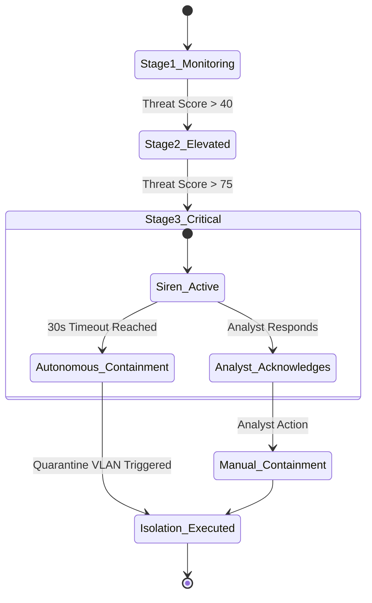

<div align="center">

# 🛡️ CyberTrace AI
### Spatial Cyber Threat Reconstruction & Autonomous Defense Platform

[](https://python.org)
[](https://fastapi.tiangolo.com)
[](https://react.dev)
[](https://www.typescriptlang.org/)
[](https://vitejs.dev)
[](https://tailwindcss.com)
[](LICENSE)

**CyberTrace AI** is an advanced next-generation Security Operations Center (SOC) platform that combines **deterministic spatial attack path reconstruction**, **explainable AI threat scoring**, **3-stage autonomous incident escalation**, **audible siren alert dispatch**, and **interactive forensic attack replay** across cyber-physical infrastructure.

[Live Demo](#-quick-start) • [Architecture](#-system-architecture) • [Core Features](#-key-features) • [Forensic Replay](#-forensic-attack-replay) • [API Docs](#-api-endpoints)

---

</div>

## 📑 Table of Contents
1. [Executive Summary](#-executive-summary)
2. [Key Features](#-key-features)
3. [System Architecture](#-system-architecture)
4. [Forensic Attack Replay & Analysis Dashboard](#-forensic-attack-replay--analysis-dashboard)
5. [Autonomous Defense & 3-Stage Escalation](#-autonomous-defense--3-stage-escalation)
6. [Attack Simulation Scenarios](#-attack-simulation-scenarios)
7. [Quick Start & Installation](#-quick-start)
8. [Default Credentials](#-default-credentials)
9. [API & WebSocket Documentation](#-api-endpoints)
10. [Deployment Guide](#-deployment-guide)

---

## 🎯 Executive Summary

Modern cyber attacks cross physical boundaries—pivoting from public guest VLANs through corporate networks, datacenter core switches, and critical databases, all the way to physical building access controllers (OT/IoT). 

**CyberTrace AI** models multi-floor enterprise infrastructure as an interactive topological graph, correlates telemetry across noisy network conditions, calculates explainable real-time threat scores, and enables deterministic forensic incident replays with deep root-cause loophole breakdowns.

```
[Attacker] 
    │
    ▼ (Floor 1: Guest Wi-Fi / Brute Force)
[EdgeRouter-101]
    │
    ▼ (Inter-VLAN Route Injection)
[CoreSwitch-301]
    │
    ▼ (SSH Local Privilege Escalation)
[AppServer-301]
    ├──► [Database-302] (SQL Credential Exfiltration)
    ├──► [FileServer-303] (Ransomware / File Destruction)
    └──► [SmartDoor-403] (BACnet/IP Physical Airlock Sabotage)
```

---

## ⚡ Key Features

### 🌐 1. Google-Supported Zero-Trust Authentication
- **Google Workspace SSO**: Authentic Google Identity authentication with interactive Account Chooser modal.
- **Analyst Passcode Verification**: Enforced Zero-Trust credentials validation with real-time feedback and password show/hide unmasking.
- **Audio Subsystem Priming**: Automatically primes the HTML5 emergency siren engine upon login.

### 🏢 2. Multi-Floor Spatial Building Topology
- Interactive 4-tier cyber-physical building visualization:
  - **Level 1: Public Edge** (Lobby, Guest Wi-Fi, Edge Routers, Concierge Kiosks)
  - **Level 2: Corporate & IoT** (Finance, Workstations, Telecom Hubs, IoT Gateways)
  - **Level 3: Datacenter Core** (Core Switches, App Servers, Enterprise Databases, File Shares)
  - **Level 4: SOC & Physical OT** (Smart Airlocks, CCTV Surveillance, BMS HVAC Chillers)

### 📊 3. Graph-Based Lateral Hop Reconstruction
- Network topology managed with `NetworkX`.
- Real-time **attack path reconstruction** deriving traversal sequence even when intermediate logs are lost or dropped.
- Dynamic blast radius calculation and impacted asset discovery.

### 🚨 4. 3-Stage Alert Escalation & Emergency Siren
- **Stage 1 (Low Threat)**: Soft visual warning banner in SOC console.
- **Stage 2 (Elevated Threat)**: High-priority modal with analyst acknowledge timer.
- **Stage 3 (Critical Threat)**: Continuous audible emergency sirens and autonomous fallback countdown.
- **Human-in-the-Loop Availability**: Set analyst status (`AVAILABLE`, `BUSY`, `AWAY`, `OFFLINE`).

### 🛡️ 5. Reversible Autonomous Containment
- One-click or autonomous device isolation.
- Automatic routing table updates isolating compromised hosts from critical database and OT segments without breaking clean network paths.

### 📂 6. Data Integrity & Automated Snapshot Recovery
- Real-time File Integrity Monitoring (FIM) with SHA-256 cryptographic hashing.
- Automated snapshot creation and point-in-time file rollback (`RESTORE_FILE`).

---

## 🎬 Forensic Attack Replay & Analysis Dashboard

The dedicated **Forensic Replay** module enables post-incident investigators and SOC analysts to replay attacks step-by-step:

| Feature | Description |
| :--- | :--- |
| **Visual Attack Simulation** | Topological visual animation tracking hops from entry point to critical assets. |
| **Transport Controls** | Play (▶), Pause (⏸), Previous (⏮), Next (⏭), Restart (↻), Scrubber, and Speed control (0.5×, 1×, 2×). |
| **Security Loophole Breakdown** | 5-point root-cause analysis: Weakness, Exploitation, Why Controls Failed, Prevention, and Remediation. |
| **Evidence Correlation** | Categorized supporting telemetry: `CONFIRMED` (Direct Log), `RECONSTRUCTED` (Inferred Telemetry), and `INFERRED` (Probabilistic). |
| **Synchronized Timeline** | Interactive chronological event stream; clicking any event jumps the replay immediately. |
| **Analyst Notes** | In-session annotations tagged to playback events with timestamp and analyst signature. |
| **Incident Dossier Export** | One-click export of a Markdown forensic investigation report (`.md`). |

---

## 🔄 Autonomous Defense & 3-Stage Escalation



---

## 🧪 Attack Simulation Scenarios

The integrated simulation engine allows deterministic execution of cyber attacks:

1. **Coordinated Multi-Floor Cyber-Physical Attack (`coordinated_attack`)**:
   - Brute force Floor 1 $\rightarrow$ Inter-VLAN tunnel $\rightarrow$ Datacenter Core Switch $\rightarrow$ Root SSH Escalation $\rightarrow$ Database Dump $\rightarrow$ File Destruction $\rightarrow$ Physical Door Lock Sabotage $\rightarrow$ CCTV Telemetry Kill.
2. **Zero-Day Ransomware Wave (`ransomware_wave`)**:
   - Phishing macro payload on Workstation-201 rapidly encrypts shared storage files; triggers snapshot detection and automated rollback.
3. **Facilities IoT & HVAC OT Sabotage (`ot_sabotage`)**:
   - Backdoored IoT Gateway compromises BMS Controller and manipulates Datacenter HVAC Chiller setpoints to induce thermal failure.
4. **Stealth Evasion Probe (`stealth_imperfect`)**:
   - Slow SYN reconnaissance under simulated network telemetry drop and transmission delay.

---

## 🚀 Quick Start

### Prerequisites
- **Python**: 3.10 or higher
- **Node.js**: 18 or higher
- **npm**: 9 or higher

### Option 1: One-Click Launch (Windows)
Double-click `start.bat` in the project root:
```bat
start.bat
```
*Automatically launches the Python FastAPI backend on port 8000 and the Vite frontend on port 5173.*

---

### Option 2: Manual Setup

#### 1. Start Python Backend
```bash
# Navigate to backend and install dependencies
cd backend
pip install -r requirements.txt

# Run the FastAPI server
uvicorn app.main:app --host 0.0.0.0 --port 8000 --reload
```
*Backend API will be running at [http://localhost:8000](http://localhost:8000)*  
*Interactive Swagger Documentation available at [http://localhost:8000/docs](http://localhost:8000/docs)*

#### 2. Start React Vite Frontend
```bash
# Open a new terminal and navigate to frontend
cd frontend
npm install

# Start Vite development server
npm run dev
```
*Frontend SOC Dashboard will be running at [http://localhost:5173](http://localhost:5173)*

---

## 🔑 Default Credentials

Use these authorized credentials or click the **One-Click Guest Demo Clearance** button on the login screen:

| Analyst ID / Email | Security Passcode | Clearance Level | Role |
| :--- | :--- | :--- | :--- |
| `analyst@cybertrace.ai` | `CyberTrace@2026` | Level 4 Alpha | Lead SOC Analyst |
| `admin@cybertrace.ai` | `Admin@CyberTrace2026` | Level 5 Omega | SOC Commander |
| `shibannandi@cybertrace.ai` | `CyberTrace@2026` | Level 5 Top-Secret | Lead SecOps Director |

---

## 📡 API Endpoints

### Core REST Endpoints
| Method | Endpoint | Description |
| :--- | :--- | :--- |
| `GET` | `/api/state` | Returns the complete real-time simulation and SOC state. |
| `POST` | `/api/simulation/scenario` | Triggers a demonstration attack scenario (`scenario_id`). |
| `POST` | `/api/simulation/reset` | Resets the simulation, alerts, devices, and files to clean baseline. |
| `POST` | `/api/simulation/pause` | Pauses or resumes simulation execution. |
| `POST` | `/api/alerts/acknowledge` | Analyst acknowledges active alert, pausing countdown timer. |
| `POST` | `/api/alerts/contain` | Approves and executes reversible containment on affected assets. |
| `POST` | `/api/devices/{id}/isolate` | Quarantines an individual device from the network. |
| `POST` | `/api/integrity/restore` | Restores a tampered file from an immutable snapshot. |

### Real-Time WebSocket
- `ws://localhost:8000/ws` — High-frequency telemetry stream broadcasting state updates every tick.

---

## 🐳 Deployment Guide

### Docker Deployment
```bash
# Build and run backend container
docker build -t cybertrace-backend -f backend/Dockerfile .
docker run -p 8000:8000 cybertrace-backend
```

### Render Deployment (`render.yaml`)
The project includes a ready-to-use `render.yaml` blueprint defining:
- Python Web Service for the FastAPI backend.
- Static Site for the React Vite frontend with automatic rewrites.

### Vercel Deployment (`vercel.json`)
The `frontend/vercel.json` configuration provides single-page application (SPA) routing for instant cloud deployment.

---

## 📜 License
This project is licensed under the MIT License — see the [LICENSE](LICENSE) file for details.

---

<div align="center">

**Built with ❤️ for Autonomous Cyber Defense & Forensic Resilience**

</div>
